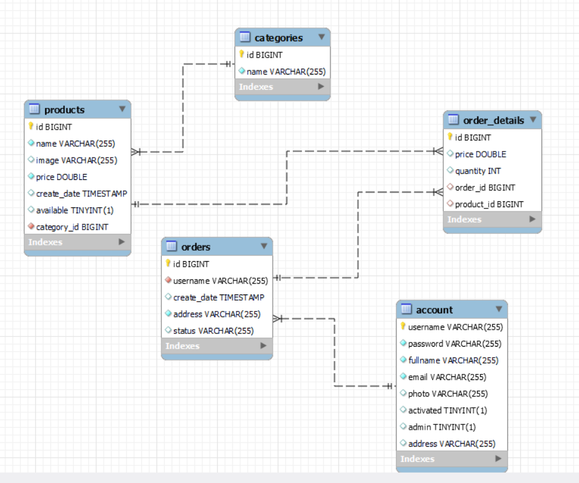
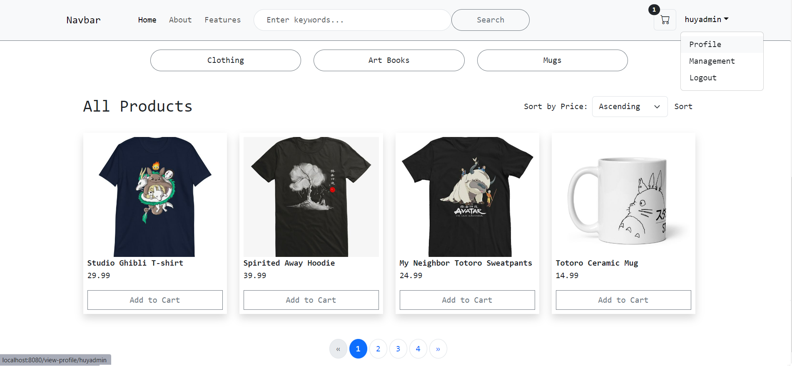
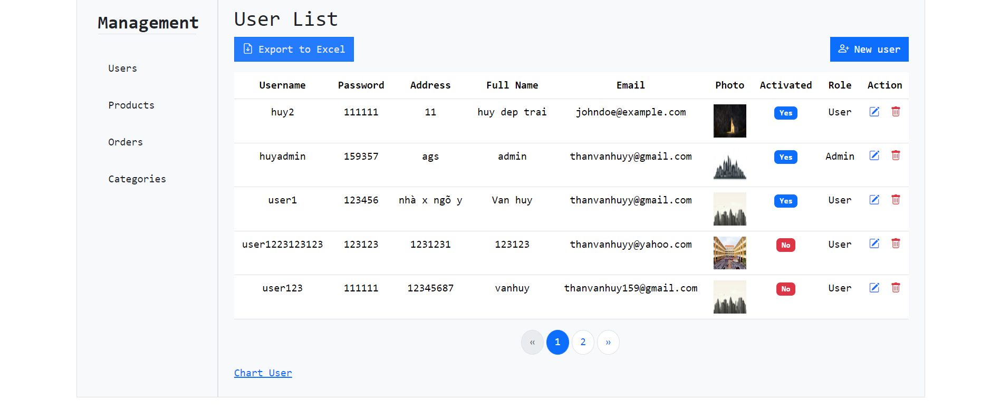
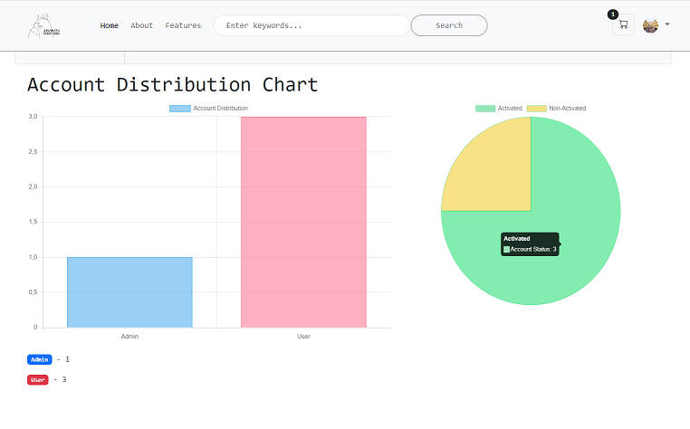

# Ecommerce Application

This is a simple ecommerce application built with Java and Spring Boot.

## Table of Contents

- [Technologies Used](#technologies-used)
- [Features](#features)
- [Setup](#setup)
  - [Prerequisites](#prerequisites)
  - [Installation](#installation)
  - [Configuration](#configuration)
- [Contributing](#contributing)

## Technologies Used

- Java
- JavaScript
- Spring Boot, Spring Security, Thymleaf
- Maven
- SQL
- ChatGPT, Copilot

## Class diagram

## Diagram



### User Features

- User registration ,login and forgot password
- Product listing
- Product search and filter
- Cart functionality
- Sorting products by price

  

### Admin Features

- CRUD operations for admin (Create, Read, Update, Delete) to manage products, category, users .



- Chart for Entity.



## Setup

### Prerequisites

Make sure you have the following installed:

- Java 8 or higher
- Maven
- MySQL

### Installation

1. Clone the repository:

   ```bash
   git clone https://github.com/Vanhuyne/ecommerce-app.git

   ```

2. Navigate to the project directory:

   ```bash
   cd ecommerce-app

   ```

3. Build the project:

   ```bash
   mvn clean install

   ```

4. Run the application:

   ```bash
   mvn spring-boot:run
   ```

## Configuration

The application can be configured by modifying the `application.properties` file. Here you can set your database connection properties, mail server properties, and other settings.
